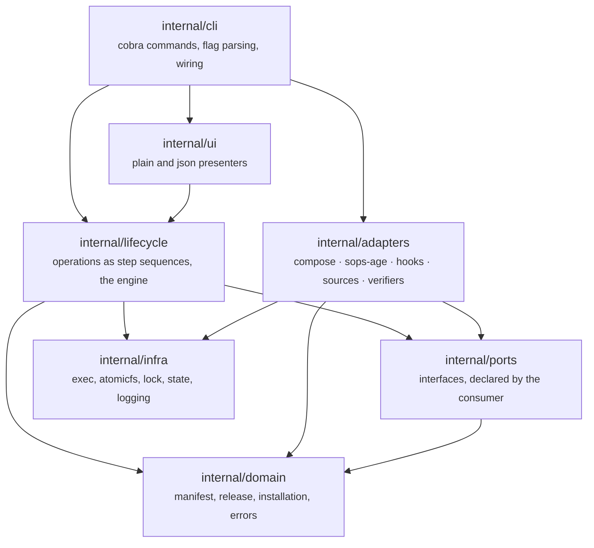

# Architecture

Dependencies point downward only. `internal/domain` imports nothing from this
repository and nothing beyond the standard library and a semver parser.

## The rule that does the work

**The lifecycle layer speaks only to ports.** The string `docker` appears
nowhere above `internal/adapters`, and `internal/cli` is the single place an
adapter is named.

This is not a style preference. It is what makes the entire test suite run
without Docker, without root and without a network — which is what makes a
fault-injection suite that kills an operation at each of eleven steps a loop
rather than an afternoon.

## It is enforced, not encouraged

`depguard` in `.golangci.yml` fails the build on a violation. That enforcement
is load-bearing rather than decorative: when the rule was first widened to cover
the whole lifecycle layer it immediately found three real violations in
`lifecycle/ops`, which was reaching for the hooks, sops-age and systemd adapters
directly. The hook ABI, the machine identity operations and unit rendering now
sit behind `HookRunner`, `SecretStore` and `Supervisor`.

A layering rule nothing checks is a paragraph in a document that the next
refactor quietly violates.

### Two rules, because one of them was doing less than it looked like

`depguard` is an import linter. It answers "may this package depend on that
one", and nothing else — so a file in `internal/ports` whose exported API is the
Docker Compose interpolation contract passes it without complaint, because that
file imports nothing at all.

That gap was found by asking what would happen if a second runtime were added,
and it is now covered by a second check: `just runtime-check` fails the build on
a name above `internal/adapters` that says which runtime is running, or on a
comparison against one. The existing mentions are an inventory rather than a
suppression list — each is classified as *port-shaped* (the concept is general,
only the name is borrowed), *Compose-shaped* (the concept is Compose's own and
has to move), or *catalogue* (a runtime named as data, which a second runtime
extends). `just runtime-inventory` prints it.

Two rules, two guarantees, and neither implies the other: **imports say what a
package may reach for; names say what it believes it is talking to.** Both are
narrower than "the architecture is correct", and the leaks that matter most —
a Compose concept wearing a neutral name — are found by reading rather than by
either.

## Interfaces are declared by the consumer

`internal/ports` holds the interfaces, and none of them are written by the thing
that implements them. `Runtime` exists because the lifecycle layer needs to
start services, not because Compose has an API worth wrapping. That is why the
methods are the ones an operation actually calls, and why an adapter that
implements them is bounded work with bounded risk: implement the interface, pass
the contract suite, register the name.

### Optional capabilities

Some things are true of one adapter and not of another. A store backed by a KMS
has no identity file to swap; a runtime with no local image store cannot say
whether an image is present.

Those live as separate interfaces that a caller type-asserts for:

| Capability | What needs it |
| --- | --- |
| `RecoverableSecretStore` | `installation export` / `import` |
| `RegistryProber` | `doctor`'s registry check |
| `ImageInspector` | `doctor`'s offline-readiness check |

An operation that needs one asserts for it and refuses by name when the
configured provider does not offer it — rather than every adapter carrying a
stub for something it cannot honestly do.

## Two deliberate departures

Both documented at the top of the packages concerned, because both look wrong
until you know why:

- **`internal/events` sits beside `domain`, not under `lifecycle`.**
  `ports.Notifier` takes an `Event`. If that type lived inside the lifecycle
  layer, `ports` would have to import the layer that consumes it, and the
  dependency arrows would stop pointing downward.
- **`internal/release` owns manifest parsing.** `domain` is restricted to the
  standard library and semver, so a YAML decoder cannot live there. Domain keeps
  the types and the validation rules; this package turns bytes into them.

## Presenters are subscribers, never participants

The engine publishes events; `internal/ui` consumes them. There is no
back-channel — a presenter cannot influence control flow, and a panic in one is
logged and dropped rather than aborting an update that is midway through
migrating a database.

Plain output is the reference for what must be conveyed. Anything richer is
motion added to information that was already complete.
