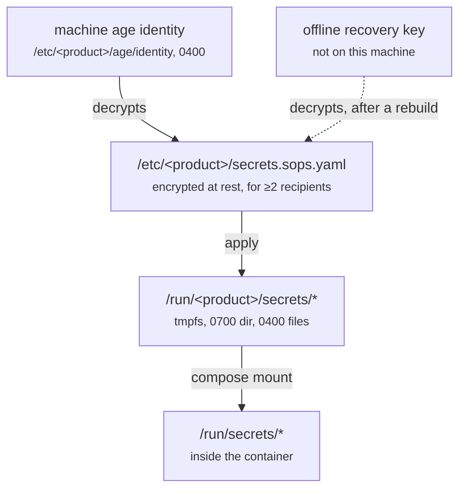

# The secrets model

## Files, not environment

A secret reaches a container as a mounted file. Never as an environment
variable, because `docker inspect` prints those and so does every crash reporter
and process listing that has ever existed.

The rendered configuration in `/etc` holds **paths** to secrets rather than
values, so a config file is never a credential — which matters because config
files end up in backups, support bundles and screenshots.

## Redaction is structural

`domain.Secret` renders as `[redacted]` through `String`, `GoString`,
`LogValue` and `MarshalJSON`. You cannot print one by accident; you have to call
`Reveal()`, which is greppable.

That is the first line. The second is a redacting `slog` handler, and the third
is the subprocess runner's output scrubber, which strips known values from
anything a hook or `docker` writes. Three independent mechanisms, because the
cost of one gap is unbounded.

Values reach `sops` over stdin, never argv.

## Why sops is a subprocess

The library pulls in the AWS, GCP and Azure KMS SDKs — tens of megabytes and a
large attack surface — for a deployment that only ever uses age.

It sits behind `SecretStore`, so the decision is reversible: if removing the
install-time dependency ever matters more than the size, the library goes behind
the same interface and nothing above it changes. The port is what makes that a
change to one package rather than a rewrite.

## At least two recipients, always

The state is encrypted for this machine **and** an offline recovery key.
`init` refuses to proceed without one unless you say `--no-recovery-recipient`
out loud.

Removing the last recipient, or the machine's own, is refused — either produces
state nothing on the machine can read, and you would not discover it until the
next `apply`, possibly after a reboot, with the product down.

### What the recovery key actually buys

A machine that is gone. Not corrupted — gone. Its age identity was on it, so the
encrypted state that survived in your backups is unreadable by anything you
still have.

Unless a second key exists somewhere else. That is the whole argument, and it is
why the manager insists on the decision at `init` rather than offering it as an
option to configure later: the moment to make it is before you need it.

The procedure is [Recovering a lost machine](../operating/recovering-a-lost-machine.md),
and it is executed end to end by the test suite on every run — a machine's
entire root deleted and rebuilt from an export plus the offline key. A recovery
path nobody has run is a recovery path you find out about during an incident.

## Where plaintext exists, and for how long

Deliberately short, and deliberately enumerated:

| Where | When | Bounded by |
| --- | --- | --- |
| Manager memory | during an operation | the process lifetime |
| `/run/<product>/secrets/*` | while the product runs | tmpfs, `0400`, cleared on reboot |
| A `secret edit` session | while your editor is open | its own `0700` directory, overwritten and removed however the editor exits |

The tmpfs assumption is load-bearing. On memory-backed storage the bytes are
pages of RAM: a reboot clears them, and overwriting them destroys them. On a
disk-backed filesystem neither holds, which is why `doctor` reports a render
directory that is not tmpfs rather than assuming.

## Rotation restarts what depends on it

The release declares which services consume which secret, so rotating one
restarts exactly those. The alternative — restarting everything — turns a
credential rotation into a full outage, which is why the declaration exists in
the manifest at all.

## What this does not defend against

A root user on the same machine. Anyone with root can read the age identity and
every rendered secret, and nothing here changes that. The model protects secrets
at rest, in transit, in logs and in backups — not from someone who already owns
the machine.
