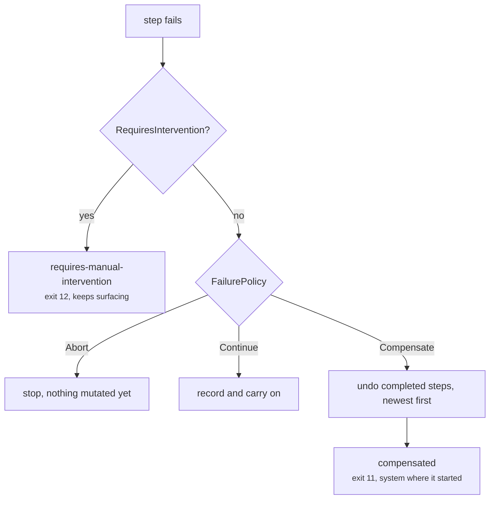
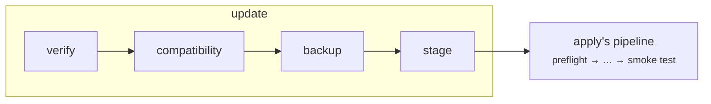

# The step engine

Every mutating command is an Operation: an id, an ordered list of steps, and a
journal record. The engine owns ordering, journaling and compensation, so an
operation is a *plan* rather than a procedure.

## Four functions

```go
Check      func(ctx, *State) (done bool, err error)  // is it already done?
Execute    func(ctx, *State) error                   // do it
Verify     func(ctx, *State) error                   // did it take effect?
Compensate func(ctx, *State) error                   // undo it
```

Only `Execute` is required. The other three each buy something specific.

**`Check` is what makes `apply` idempotent.** A satisfied postcondition marks
the step skipped, so converging an already-converged system runs nothing and
says so. Idempotence built this way is a property of each step rather than a
claim about the whole.

**`Verify` is separate from `Execute` because a tool exiting zero is not the
same claim as the system being in the desired state.** `docker compose up`
returning 0 says the command succeeded; it does not say the services are
healthy. Two questions, two functions.

**`Compensate` undoes.** Not every step has one, and that is fine — most steps
without a compensator are simply read-only.

## What happens when a step fails



Compensation runs newest-first and **includes the step that failed** — it may
have mutated before failing, which is exactly the case a `Verify` failure
describes.

## The distinction that matters most

Three outcomes that a lesser design would collapse into "error":

| Status | Exit | What it means |
| --- | ---: | --- |
| `failed` | varies | The system is where it started. |
| `compensated` | 11 | Partial work was successfully undone. |
| `requires-manual-intervention` | 12 | It could not be, and a human has to look. |

Collapsing these would hide exactly the case that needs a person. Exit 12 keeps
surfacing in `status` and `doctor` until an operator clears it explicitly, and
the systemd unit sets `RestartPreventExitStatus=12` so a machine that needs a
human stops instead of looping.

### Intervention is declared, not inferred

`RequiresInterventionOnFailure` is an explicit field on a step. Inferring it
from a missing compensator was the obvious shortcut and would have been wrong:
most steps without one are read-only, so every failed health check would demand
human acknowledgement. That trains people to clear the flag without looking,
which destroys the value of the one signal meant to stop them.

Migrations and restores declare it. Health checks do not.

## The journal

Every transition is written **before and after** the work:

```json
{"id":"op_01KZ…","type":"update","status":"running","steps":[…]}
```

Before, so a crash mid-step leaves a record saying which step was in flight.
After, so a completed step is known to be complete. That is what makes `--resume`
possible: the journal says where to pick up, rather than the operation guessing.

It is append-only and the ids are ULIDs — lexicographically sortable and
timestamp-prefixed — so reading the file in order is reading the history in
order.

## Reuse rather than duplication

`update` is four steps of its own followed by `apply`'s eleven:



Duplicating those eleven would mean two lists to keep in agreement, and the
second one would be the one nobody tests. `rollback` does the same thing from
the other direction: swap the pointer, then converge with the same pipeline.

## Dry runs

`--dry-run` runs the plan without any `Execute`. It reports the step list, marks
what `Check` says is already done, and renders a configuration diff.

It deliberately does **not** take the deployment lock: planning mutates nothing,
and making `--dry-run` wait on a running update would defeat the point of being
able to inspect a plan while one is in flight.
