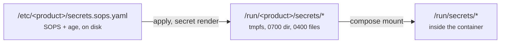

# Managing secrets

The command surface is in [`secret`](../reference/secret-commands.md); this is
how the day-to-day tasks go.

## Where a secret lives



Values never reach process arguments, logs, the operation journal, or
`--json` output. Rendered configuration in `/etc` contains **paths** to secrets,
never the values — so a config file on disk is never a credential.

## Setting one

```sh
morzer secret set db_password              # prompts, without echo
printf %s "$VALUE" | morzer secret set db_password
```

There is deliberately no flag for the value: process arguments are readable
through `/proc` by any local user, so a credential passed that way is a
credential published.

## Rotating one

```sh
morzer secret rotate db_password
```

Generates a new value of the shape the release declares, and restarts **only**
the services that declare a dependency on it. That declaration is why the
manifest has a `services:` list per secret, and the difference between a
two-second blip and a full outage.

`doctor` tells you when something is due:

```text
[warn] secrets are within their declared rotation period:
       db_password is 94d old (policy 90d)
       → rotate with `morzer secret rotate db_password`
```

A warning, never a failure. The period is the release author's recommendation,
and failing an exit code your monitoring watches over a recommendation is how a
team learns to ignore the whole signal. A secret whose release declares no
period is never mentioned.

## Changing several at once

```sh
morzer secret edit                          # all of them
morzer secret edit db_password session_key  # just these
```

Opens `$VISUAL` or `$EDITOR` on a plain mapping. Rotating a related group of
credentials — an application password and the key derived from it — is one
logical change, and doing it as several `secret set` calls is several chances to
stop halfway.

This is the one place a decrypted secret is written to a filesystem. The session
lives in its own directory inside the tmpfs render directory and is overwritten
and removed however the editor exits. See
[`secret edit`](../reference/secret-commands.md#secret-edit) for the details and
the refusals.

## Who can decrypt

```sh
morzer secret list        # names and fingerprints, never values
morzer secret recipients list
```

The state is always encrypted for at least two recipients: this machine, and an
offline recovery key. Removing the last recipient, or the machine's own, is
refused — either would produce state nothing on the machine could read.

The fingerprint in `secret list` is what lets you confirm two machines hold the
same value without either of them printing it.

### Adding an operator key

```sh
morzer secret recipients add age1… --kind operator --comment "alice, ops"
```

The state is re-encrypted for the new set immediately. Removing one:

```sh
morzer secret recipients remove age1…
```

## If the storage is not tmpfs

```text
[warn] decrypted secrets live on memory-backed storage:
       /run/demo/secrets is ext4, not tmpfs
```

On tmpfs, the decrypted bytes are pages of RAM: a reboot clears them and
overwriting them destroys them. On a disk-backed filesystem neither holds — old
contents can survive in a journal or an unreferenced extent that nothing will
hand back and nothing has erased.

A container with no tmpfs mounted is a legitimate way to run this, which is why
this warns rather than refuses. Mount one at `/run/<product>` if you can.

## Losing the machine

That is what the recovery key is for, and it has its own procedure:
[Recovering a lost machine](recovering-a-lost-machine.md).
