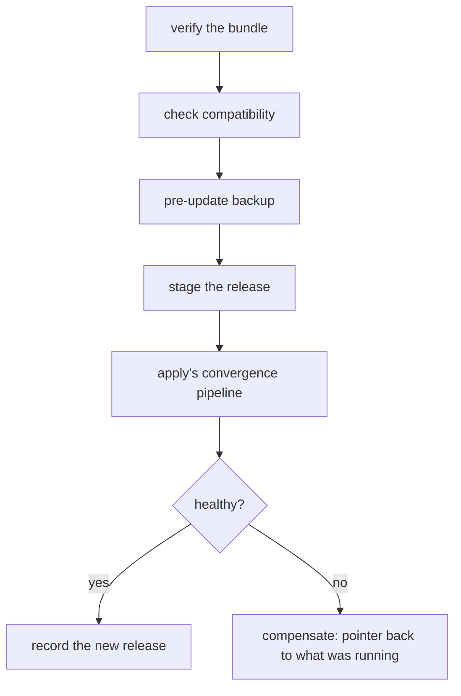

# Updating

```sh
morzer update ./demo-1.3.0.tar.zst
morzer update --to 1.3.0                 # already in the release store
morzer update https://releases.example/demo-1.3.0.tar.zst
```

An update is not a deployment script. It is a sequence with a gate at the front,
a backup in the middle, and a defined answer for every way it can fail.

## Finding out a release exists

```sh
morzer update --check
```

| Flag | Meaning |
| --- | --- |
| `--check` | Report whether a newer release exists, without installing anything. |

Asks the release source what versions it offers, and reports the newest one
this installation could move to. Nothing is downloaded and nothing is
installed.

It needs to know where to look. `update` records the ref it installed from, so
after one update from a registry the check has a source; before that, or after
installing from a local path, pass one:

```sh
morzer update --check oci://registry.example/demo/bundle
```

Only an OCI registry keeps a tag list, so that is the only transport that can
answer. A source that cannot enumerate **says so** rather than reporting "up to
date" — the second would be an answer nobody gave, and it is the one you would
act on.

### Checking without being asked

`doctor` and `status` can report the same thing, and they are off by default:

```sh
morzer config set update.check=true
```

```yaml title="installation.yaml"
update:
  check: true
```

A check contacts the vendor's registry, which reveals an IP, a timestamp and by
inference the version you are running. For a product you chose to self-host,
turning that on by default would be a phone-home nobody agreed to — so
unprompted paths honour this setting, and it is absent-means-off.

`morzer update --check` ignores it. Typing the command is the consent.

`update.check` and `update.channel` are **installation settings**, not release
parameters: they are your arrangement with the manager rather than a knob the
vendor declared, and they change nothing that is running.
`morzer config settings` lists them.

## Following a channel

A channel is one reference that moves — the pattern a container registry's own
`latest` follows:

```sh
morzer config set update.channel=oci://registry.example/demo/bundle:stable
morzer update --stage
```

| Flag | Meaning |
| --- | --- |
| `--stage` | Fetch and verify what the channel points at, without installing it. |

This is a **different operation** from `--check`, not a spelling of it.
`--check` enumerates version tags and picks the highest one you could move to,
which needs tags that are versions. A channel is a tag that is not a version and
that changes what it points at, so enumeration cannot follow one.

The tag moves; the bundles behind it each carry a distinct version. So nothing
about immutable releases is weakened — the never-republish rule keeps working on
the versions while the channel does its work on the pointer.

### What a tick costs

A poll asks the registry what the tag points at — one manifest request. Only
when the answer differs from what this machine has already seen is anything
downloaded. An unchanged channel therefore costs a few hundred bytes, whatever
the size of the release.

There is **no interval floor**. The cost belongs to your vendor's registry
rather than to the manager, and a rate-limited registry counts manifest
requests: a cadence chosen without regard to that will exhaust a budget other
things need.

### Staged, not installed

What `--stage` leaves behind is a release fetched, verified against your
signature policy, and sitting in the store — with nothing about the running
deployment changed:

```sh
morzer status              # shows: staged 1.4.0 (not installed)
morzer update --check      # prints the incoming release's notes
morzer update --to 1.4.0   # installs it, when you choose
```

That middle state is where most of the value is and almost none of the risk:
the network, the credentials and the verification happen ahead of time, and the
decision that costs downtime stays yours. A staged release is exempt from
retention until it is installed or superseded, so `release prune` cannot remove
the candidate a poll just fetched.

The bundle is fetched **by digest**, not by tag. A channel is a tag built to
move, so between the moment the manager reads it and the moment it downloads,
the tag may point somewhere else — pinning to what was actually read closes
that window.

If the channel offers something unusable — a version older than the one
installed, or a version already installed republished with different content —
it is refused and the refusal is *recorded*, so the next tick does not download
the same bundle again to reach the same answer. `status` reports it.

## What happens, in order



The first two steps mutate nothing, so a bundle that fails them costs you
nothing but the time to read the error.

## Before it starts

**Verification.** The bundle is checked against its digest if you pinned one,
against the `SHA256SUMS` it ships, and against your configured signing keys if
your installation requires signatures. See
[Verification](../reference/release-commands.md#verification).

```sh
morzer update ./demo-1.3.0.tar.zst --digest sha256:bcca96e8…
```

Pin the digest when you have one. It is the difference between "a release
claiming to be 1.3.0" and "the release the vendor published as 1.3.0".

**Compatibility.** The release declares what it can be installed over:

```yaml
compatibility:
  upgrade_from: ">=1.2.0 <2.0.0"
  database_schema_min: 12
  database_schema_max: 14
  min_manager_version: "1.0.0"
```

All four are checked against what is actually running. A failure here is
[exit 9](../reference/exit-codes.md) and **`--force` does not override it** — a
release stating it cannot be installed over what you have is stating a fact
about its migrations, not expressing a preference.

**A backup.** Taken automatically, before anything is staged. It is what a
failed migration is recovered from, and it is the backup a refused rollback will
name.

`--skip-backup` exists and requires `--force`, and the choice is recorded in the
journal so an incident review can see it was made deliberately.

## When it fails

The release pointer goes back to what was running, and the previously-running
release is what comes back up. The staged release and the backup both stay —
you will want them to diagnose with.

**The database is never rolled back automatically.** Containers are reversible
and data is not, and a tool that pretended otherwise would be a tool that
occasionally destroyed a database while reporting success. If the migration ran
and the update then failed, your options are forward (fix and re-run) or a
[restore](backups.md#restoring) from the backup taken at the start.

An operation that mutated something it could not undo exits
[12](../reference/exit-codes.md) and keeps surfacing in `status` and `doctor`
until you clear it explicitly.

## Planning first

```sh
morzer update ./demo-1.3.0.tar.zst --dry-run
```

Resolves and verifies the bundle, runs the compatibility gate, and prints the
step list with a configuration diff — without taking the deployment lock, so you
can inspect a plan while something else is running.

For a reference that has to be fetched, a dry run does fetch: a plan that
refused to could tell you nothing about the release you asked about. It goes to
the staging directory and is removed when the command ends.

## After it lands

```sh
morzer status
morzer doctor
morzer release list
```

The store keeps the previous release so that rolling back has somewhere to go —
how many, in total, is the manifest's `retention.releases`.
