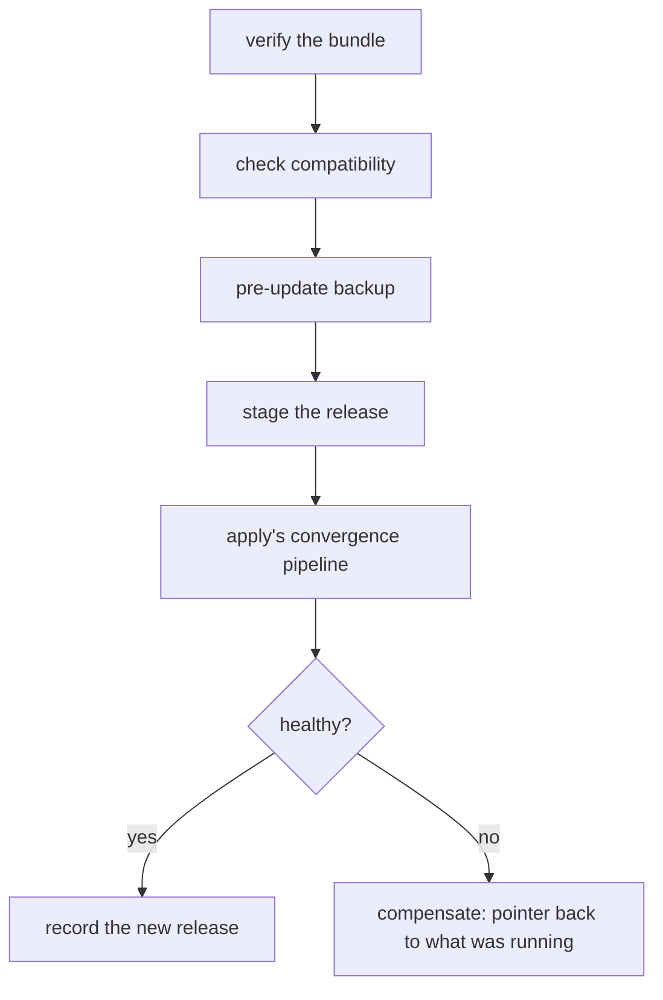

# Updating

```sh
morzer update ./demo-1.3.0.tar.zst
morzer update --to 1.3.0                 # already in the release store
morzer update https://releases.example/demo-1.3.0.tar.zst
```

An update is not a deployment script. It is a sequence with a gate at the front,
a backup in the middle, and a defined answer for every way it can fail.

## What happens, in order



The first two steps mutate nothing, so a bundle that fails them costs you
nothing but the time to read the error.

## Before it starts

**Verification.** The bundle is checked against its digest if you pinned one,
against the `SHA256SUMS` it ships, and against your configured signing keys if
your installation requires signatures. See
[Verification](../reference/release-commands.md#verification).

```sh
morzer update ./demo-1.3.0.tar.zst --digest sha256:bcca96e8…
```

Pin the digest when you have one. It is the difference between "a release
claiming to be 1.3.0" and "the release the vendor published as 1.3.0".

**Compatibility.** The release declares what it can be installed over:

```yaml
compatibility:
  upgrade_from: ">=1.2.0 <2.0.0"
  database_schema_min: 12
  database_schema_max: 14
  min_manager_version: "1.0.0"
```

All four are checked against what is actually running. A failure here is
[exit 9](../reference/exit-codes.md) and **`--force` does not override it** — a
release stating it cannot be installed over what you have is stating a fact
about its migrations, not expressing a preference.

**A backup.** Taken automatically, before anything is staged. It is what a
failed migration is recovered from, and it is the backup a refused rollback will
name.

`--skip-backup` exists and requires `--force`, and the choice is recorded in the
journal so an incident review can see it was made deliberately.

## When it fails

The release pointer goes back to what was running, and the previously-running
release is what comes back up. The staged release and the backup both stay —
you will want them to diagnose with.

**The database is never rolled back automatically.** Containers are reversible
and data is not, and a tool that pretended otherwise would be a tool that
occasionally destroyed a database while reporting success. If the migration ran
and the update then failed, your options are forward (fix and re-run) or a
[restore](backups.md#restoring) from the backup taken at the start.

An operation that mutated something it could not undo exits
[12](../reference/exit-codes.md) and keeps surfacing in `status` and `doctor`
until you clear it explicitly.

## Planning first

```sh
morzer update ./demo-1.3.0.tar.zst --dry-run
```

Resolves and verifies the bundle, runs the compatibility gate, and prints the
step list with a configuration diff — without taking the deployment lock, so you
can inspect a plan while something else is running.

For a reference that has to be fetched, a dry run does fetch: a plan that
refused to could tell you nothing about the release you asked about. It goes to
the staging directory and is removed when the command ends.

## After it lands

```sh
morzer status
morzer doctor
morzer release list
```

The store keeps the previous release so that rolling back has somewhere to go —
how many, in total, is the manifest's `retention.releases`.
